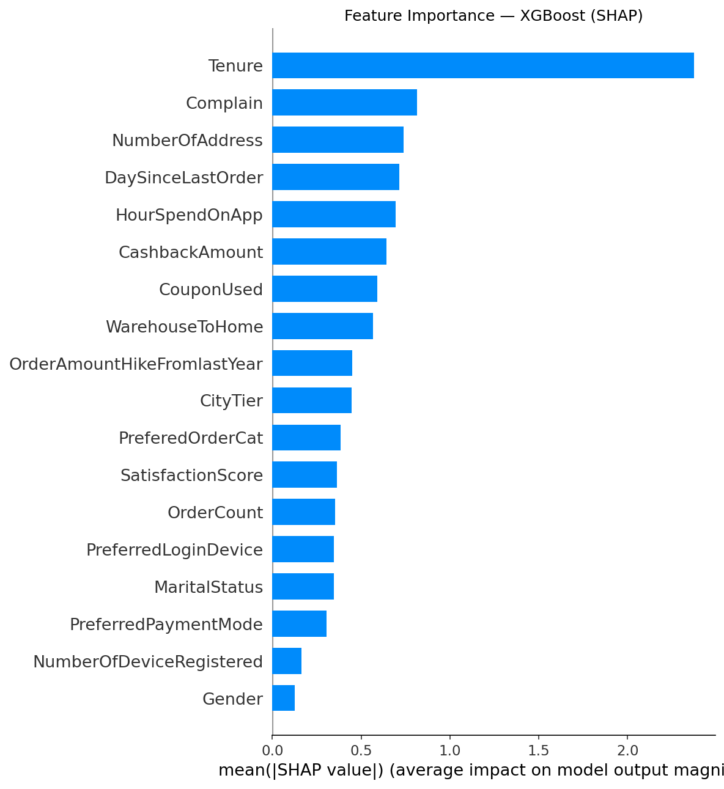

# 🛒 E-Commerce Customer Churn Prediction

End-to-end machine learning pipeline untuk memprediksi pelanggan e-commerce yang berisiko churn, dilengkapi dengan dashboard interaktif berbasis Streamlit.


---

## 📌 Overview

Churn pelanggan adalah salah satu tantangan terbesar dalam bisnis e-commerce. Project ini membangun model ML yang mampu **mengidentifikasi pelanggan berisiko churn sebelum mereka benar-benar pergi**, sehingga tim bisnis dapat mengambil tindakan retensi lebih awal dan tepat sasaran.

---

## 🏆 Hasil Model

| Model | AUC-ROC | Recall | F1-Score | Accuracy |
|---|---|---|---|---|
| Logistic Regression (baseline) | 0.8301 | 0.7981 | 0.7642 | 0.7539 |
| Random Forest | 0.9993 | 0.9957 | 0.9894 | 0.9893 |
| **XGBoost (final)** | **0.9984** | **0.9944** | **0.9909** | **0.9909** |

> Model final: **XGBoost** dengan 5-fold Cross Validation Recall = **0.9944 (±0.0040)**

---

## 📊 Key Findings

- **Tenure** adalah fitur terpenting — pelanggan baru jauh lebih berisiko churn
- **Complain** berkorelasi kuat dengan churn — komplain yang tidak ditangani = pelanggan pergi
- **COD** (Cash on Delivery) memiliki churn rate tertinggi (~28%) di antara semua metode pembayaran
- **Pelanggan Single** memiliki churn rate tertinggi (~26%) berdasarkan status pernikahan
- **16.84%** pelanggan dalam dataset terbukti churn — class imbalance ditangani dengan SMOTE

---

## 🗂️ Struktur Project

```
ecommerce-churn-prediction-ml/
├── data/
│   ├── raw/                          ← dataset mentah (tidak di-upload)
│   └── processed/
│       └── data_preprocessed.csv     ← data hasil preprocessing
├── notebooks/
│   ├── 01_EDA.ipynb                  ← exploratory data analysis
│   ├── 02_Preprocessing.ipynb        ← data cleaning & feature engineering
│   ├── 03_Modeling.ipynb             ← training & evaluasi model
│   └── 04_Explainability.ipynb       ← SHAP analysis
├── models/
│   ├── xgboost_churn.pkl             ← model final tersimpan
│   ├── shap_summary_bar.png          ← feature importance plot
│   └── shap_beeswarm.png             ← SHAP beeswarm plot
├── app/
│   └── streamlit_app.py              ← dashboard interaktif
├── .gitignore
└── README.md
```

---

## 🔄 Pipeline

### 1. Exploratory Data Analysis (`01_EDA.ipynb`)
- Analisis distribusi churn (83% tidak churn vs 17% churn)
- Visualisasi distribusi fitur numerik dan kategorikal
- Analisis churn rate per segmen (payment method, gender, marital status, dll)
- Heatmap korelasi antar fitur

### 2. Preprocessing (`02_Preprocessing.ipynb`)
- Drop kolom tidak relevan (`CustomerID`)
- Median imputation untuk 7 kolom dengan missing values (4-5%)
- Winsorization untuk menangani outlier (5% tiap sisi)
- Label Encoding untuk 5 kolom kategorikal
- SMOTE untuk menangani class imbalance (5.630 → 9.364 baris, balanced 50/50)

### 3. Modeling (`03_Modeling.ipynb`)
- Train/test split 80/20 dengan stratifikasi
- Melatih 3 model: Logistic Regression, Random Forest, XGBoost
- Evaluasi dengan Confusion Matrix, ROC Curve, Classification Report
- 5-fold Stratified Cross Validation
- Model terbaik disimpan ke `models/xgboost_churn.pkl`

### 4. Explainability (`04_Explainability.ipynb`)
- SHAP TreeExplainer untuk model XGBoost
- Feature importance bar plot
- Beeswarm plot untuk arah pengaruh tiap fitur

---

## 🛠️ Tech Stack

| Kategori | Library |
|---|---|
| Data manipulation | `pandas`, `numpy` |
| Visualisasi | `matplotlib`, `seaborn` |
| Modeling | `scikit-learn`, `xgboost` |
| Class imbalance | `imbalanced-learn` (SMOTE) |
| Explainability | `shap` |
| Deployment | `streamlit` |
| Model persistence | `joblib` |

---

## 🚀 Cara Menjalankan

### 1. Clone repository
```bash
git clone https://github.com/rifqifauzi24/ecommerce-churn-prediction-ml.git
cd ecommerce-churn-prediction-ml
```

### 2. Install dependencies
```bash
pip install pandas numpy matplotlib seaborn scikit-learn xgboost imbalanced-learn shap streamlit joblib openpyxl
```

### 3. Jalankan Streamlit dashboard
```bash
cd app
streamlit run streamlit_app.py
```

---

## 📈 SHAP Feature Importance



Top 5 fitur yang paling berpengaruh terhadap churn:
1. **Tenure** — makin singkat masa berlangganan, makin tinggi risiko churn
2. **Complain** — adanya komplain meningkatkan risiko churn signifikan
3. **NumberOfAddress** — alamat banyak mengindikasikan pelanggan tidak stabil
4. **DaySinceLastOrder** — lama tidak order = sinyal akan churn
5. **HourSpendOnApp** — makin sering buka app, makin loyal

---

## 💡 Business Recommendation

Berdasarkan hasil model, tim bisnis disarankan untuk:

- 🎁 **Pelanggan baru (tenure < 3 bulan)** → berikan welcome bonus atau voucher onboarding
- 📞 **Pelanggan yang komplain** → hubungi dalam 24 jam untuk penyelesaian
- 💰 **Pelanggan cashback rendah** → tingkatkan program cashback personal
- 📧 **Pelanggan lama tidak order** → kirim email re-engagement dengan penawaran spesial
- 🎯 **Pelanggan risiko tinggi** → masukkan ke program loyalitas prioritas

---

## 📦 Dataset

- **Sumber:** [Kaggle — E-Commerce Customer Churn](https://www.kaggle.com/datasets/ankitverma2010/ecommerce-customer-churn-analysis-and-prediction)
- **Ukuran:** 5.630 pelanggan, 20 fitur
- **Target:** kolom `Churn` (0 = tidak churn, 1 = churn)
